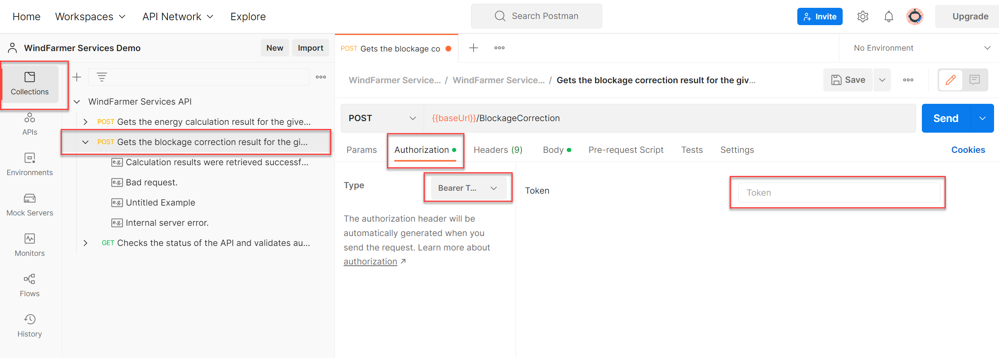

# Blockage Correction, WindFarmer Services API end point

For API setup see the general web API READ ME in the parent folder. 

## Post BlockageCorrection
The BlockageCorrection calculation takes simple inputs of:
*	turbine locations, heights, rotor diameters 
*	frequency distribution, power curve, thrust curve
*	significant atmospheric stability

It returns a blockage correction factor between 0 and 1. 

##  Excel blockage correction tool
The excel tool ```DNV Blockage API inputs and calling tool v*.xlsm``` provides a simple user interface for preparing blockage correction inputs. It helps you to construct a JSON input to the blockage correction calculation that you could use within Postman or from a python script. The tool also has an option to call the API directly to check status and run a blockage correction calculation. See the Notes tab for full instructions on useage. 

## Blockage correction using Postman
To run a blockage correction calculation in Postman you may use the following process: 
*   First get your access token and set up postman according to the instructions in the the general web API READ ME
*   In Postman select the endpoint to Post BlockageCorrection and set the bearer token. 
    *   Click **Collections**, Expand the WindFarmer Services API, Click "Post get the blockage correction..."
    *   in the **Authorization** tab
    *	set **Type** as **Bearer Token**
    *   paste in your access token 
    

*	Define your inputs in the **Body** tab
    *	Paste in input JSON. See an example ```./Input/BlockageCorrection_input_data.json```
*	Click Send, see the response results body
To generate the json input file for your project, we suggest you use the excel tool described in section 2. 

##  Python blockage correction examples

### Blockage demo
The jupyter notebook ```Blockage_demo_notebook.ipynb``` and the script ```Blockage_demo_from_files.py``` demonstrate testing the API connection by calling the status end point then calling the blockage correction end point using the pre-prepared ```BlockageCorrection_input_data.json``` file in the ```./input``` folder to construct the API call. 

To generate the json input file for your project you can use the an excel tool shared in this repository. 

### Blockage demo from files notebook
The examples ```Blockage_demo_from_files.py``` and ```Blockage_demo_from_files.ipynb``` show how you might construct the json inputs to the API from alternative input files of tab separated columnar text.

These input file examples in ```.\input\BlockageWebAppInputs``` are parsed and converted to the JSON data to be sent to the API.

