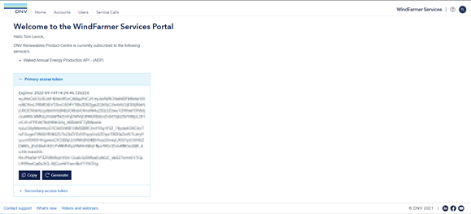

# WindFarmer Services API setup

Here we explain a recommended way to setup and check that the web API is running. 

We walk you through getting your access key, then calling the API from either Postman or a Python script. 

## ACCESS KEYS
To make a request to the API you need to provide a valid access key. 

The access key is a time limited **JWT** token, it appears as a long random string of characters. When making calls to the API this is included in the request header as a **bearer token**. 

Please keep this access key secure and treat it like a password. 


## WindFarmer services portal 
To access and manage your access key for the WindFarmer API visit the [WindFarmer Services Portal](https://windfarmer.dnv.com/).

 

A veracity account is required to access the portal. Once a veracity account is created the WindFarmer team can grant access to the API key for a company admin user. 

The Company admin user will be able to log in with their veracity credentials and access their company API key. Expand the **Primary access token** section then click **Copy** to get the key on your clipboard.

Please note that all access keys expire automatically after 1 year or less for security reasons.

The company admin can also regenerate new access keys. 

Regenerating an access key will revoke the old access key. You may wish to do this if you suspect the key has been taken outside your company. 

##	Environment variable to store API access key
A recommended secure way to store and use the access key is by saving it in an environment variable associated with your user profile. We will assume you have saved the key in an environment variable in any of the WindFarmerAutomation demos. You can set an environment variable as follows:

* Open **edit system environment variables**
* Go to **Advanced** > **Environment variables**
* Click **New** for **User variables**:
* Give the variable a name: “WINDFARMER_ACCESS_KEY”
* Paste in your access key
* Click OK to close and save the token.
  
**From python…**
You can now access the environment variable as a string from any python script importing the ```os``` package and calling ```os.environ['WINDFARMER_ACCESS_KEY']```

*Note: you may need to restart your python environment to get updated environment variables.*

## USING THE WINDFARMER API VIA POSTMAN
Postman is a widely used tool for testing web APIs. It allows you to make calls to APIs with no code. You can manually specify inputs, authorisation access keys, and see the responses. 

### Get a postman account
You can use the PostMan web application found at https://www.postman.com/ to call our API. First sign up for a postman account. The individual account is free and sufficient for using the blockage correction API.
You can also install the Postman desktop application from https://www.postman.com/downloads/ if you would prefer. 
To try the WindFarmer API through postman then:

###	Import the “Open API specification”
In Postman first select a workspace, then click Import.
 
Select the WindFarmer open API specification file e.g. “WindFarmerAPI_openapi.json”
Postman will recognise this specification and create a browser for you to explore each callable end point.
 
###	Check API connection in Postman
#### Get Status
The Get Status end point takes no inputs. Get status can be called even with expired or revoked access tokens to see if the service is running. 

**Postman process:**
*	Select Collections on the side bar
*	Select Get Status end point.
*	Authorization tab
*	set type as bearer Token
*	paste in your JWT access token key 
*	Click Send request to confirm you can connect to the API
*	The response body confirms you can successfully use the API and the API version.
 
##	PYTHON EXAMPLES
Multiple python examples are provided. You may need to install some packages described below.

###	General Packages required
From python you can call the API directly, using the `urllib3` or `requests` packages. Our examples use the requests package. You can simply install and use our wf_auto conda environment as described in the WindFarmerAutomation/README.md to reliably run our examples.

Alternatively you may install libraries into your own environment. To install requests, open a python command prompt for your chosen environment and install:

**Installation using Pip:**

```$ python -m pip install requests```

**Installation using Conda:**

```conda install -c anaconda requests```

The examples also use the following packages:
*	os		for accessing environment variables
*	Json		for reading the json response from API
*	Time		for timing certain functions
*	Pandas		for parsing in text data
*	Matplotlib	for plotting and checking some inputs 

###	Jupyter Notebooks
Jupyter notebooks [.ipynb files] can be run in several IDEs to provide an interactive python environment interspersed with documentation. It will take you through the process of accessing the API step-by-step. 
Compatible IDEs include Jupyter Notebook, Jupyter Lab, Visual Studio Code (with an extension), or Spyder with the notebook plugin.

###	Python scripts [.PY files]:
Other examples are provided as Python scripts (.Py files). These can be run in any python environment with the necessary packages.

